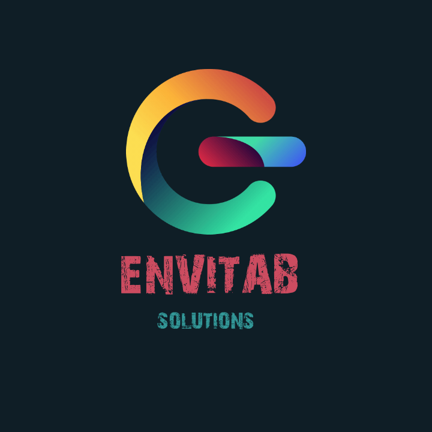

  

# Envitab 🌍

Envitab is an online waste disposal platform that connects waste disposal companies with individuals and businesses seeking efficient and sustainable waste management solutions.

🚀 [Live Demo](https://envitab.netlify.app/) | 📖 [Documentation](/README.md)

## Features

✅ Streamlined Waste Disposal: Schedule waste pickups, track service status, and manage your waste disposal requests effortlessly.

🗺️ Intelligent Route Optimization: Optimize waste collection routes using AI algorithms, reducing travel time, fuel consumption, and environmental impact.

🔄 Real-time Updates: Stay informed with real-time notifications about the status of your waste disposal requests and pickup schedules.

💳 Secure Payments: Make secure online payments for waste disposal services using multiple payment methods.

📊 Analytics and Reporting: Gain insights into waste management performance, track key metrics, and make data-driven decisions.

## Contact

Have questions or suggestions? Feel free to reach out!

- 📧 Email: [contact@envitab.com](mailto:ekeminisamuel19@gmail.com)
- 💬 LinkedIn: [Envitab](https://www.linkedin.com/company/envitab/)
- 🐦 Twitter: [@realEkemini](https://twitter.com/realEkemini)

Enjoy hassle-free waste disposal with Envitab! Together, let's build a cleaner and more sustainable future. ♻️🌍
